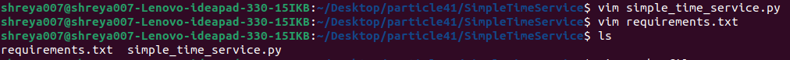
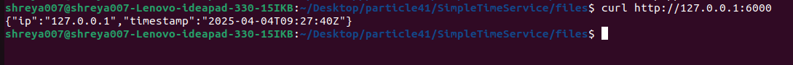
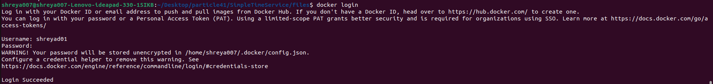
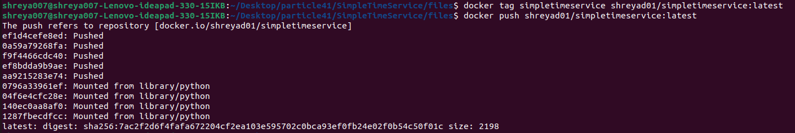

# SimpleTimeService
### Overview
SimpleTimeService is a lightweight Python microservice that returns the current timestamp and the IP address of the visitor in JSON format.
### Features
- Returns the current timestamp in UTC format.
- Captures the visitor's IP address.
- Runs as a non-root user inside a Docker container.

### Steps
- Create simple microservice in python
[simple_time_service.py](simple_time_service.py)

- Create requirements.txt file to store require files
  
  

- write Dockerfile and install the dependencies 

  

- Execute the *Simple_time_service.py* file.

  

-Visit http://127.0.0.1:6000 in your browser or use curl http://127.0.0.1:6000

  

- Build the docker image by running following command :

      docker build -t simpletimeservice .

  
  

- Run the container by using following command :
    
      docker run -p 6000:6000 simpletimeservice 

  

- Access the Service by using following command :
        
        Visit http://localhost:6000/ in your browser or 
        use curl http://localhost:6000
  
   

- Login to **DockerHub** by using username and password

       docker login 

    
- Tag and push image to **DockerHub**
   
      docker tag simpletimeservice <your-dockerhub-username>/  simpletimeservice:latest

      docker push <your-dockerhub-username>/simpletimeservice:latest

    

