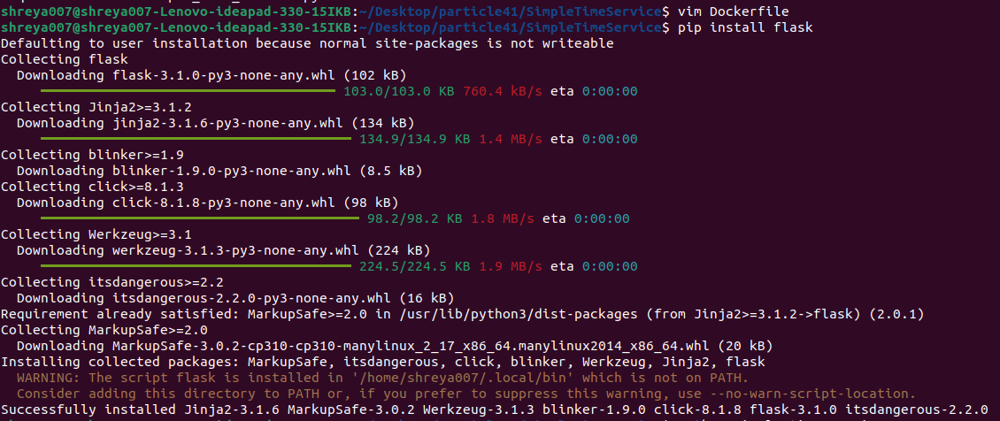
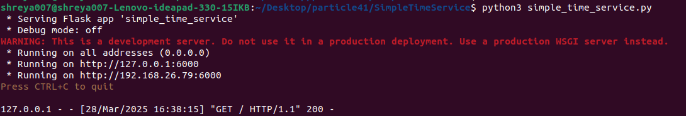
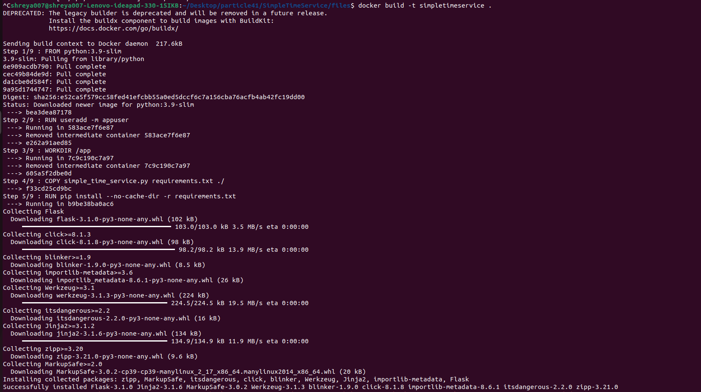
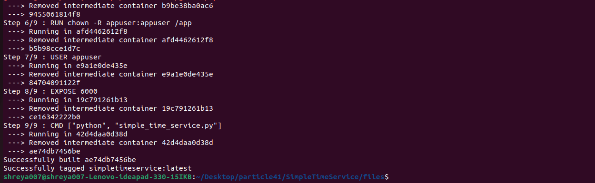
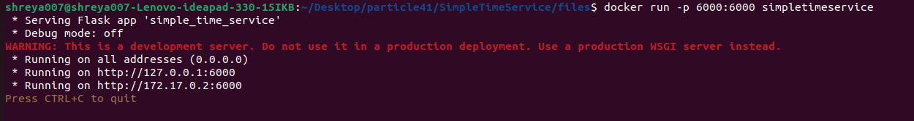

# SimpleTimeService
### Overview
SimpleTimeService is a lightweight Python microservice that returns the current timestamp and the IP address of the visitor in JSON format.
### Features
- Returns the current timestamp in UTC format.
- Captures the visitor's IP address.
- Runs as a non-root user inside a Docker container.

#### Steps
- Create simple microservice in python
[simple_time_service.py](simple_time_service.py)

- Create requirements.txt file to store require files
  

- write Dockerfile and install the dependencies 

- Execute the *Simple_time_service.py* file.

-Visit http://127.0.0.1:6000 in your browser or use curl http://127.0.0.1:6000

- Build the docker image by running following command :

      docker build -t simpletimeservice .

- Run the container by using following command :
    
      docker run -p 6000:6000 simpletimeservice 

- Access the Service by using following command :
       Access the Service